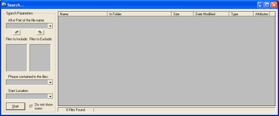

<div align="center">

## File & Folder Search


</div>

### Description

A program to search files and folders like the one supplied with Windows. My Windows searcher keeps failing after a few weeks so I put this one together. I used as much API as I could.
 
### More Info
 


<span>             |<span>
---                |---
**Submitted On**   |2003-06-09 14:16:16
**By**             |[Matty\_ski](https://github.com/Planet-Source-Code/PSCIndex/blob/master/ByAuthor/matty-ski.md)
**Level**          |Beginner
**User Rating**    |5.0 (25 globes from 5 users)
**Compatibility**  |VB 5\.0, VB 6\.0
**Category**       |[Files/ File Controls/ Input/ Output](https://github.com/Planet-Source-Code/PSCIndex/blob/master/ByCategory/files-file-controls-input-output__1-3.md)
**World**          |[Visual Basic](https://github.com/Planet-Source-Code/PSCIndex/blob/master/ByWorld/visual-basic.md)
**Archive File**   |[File\_&\_Fol1599436102003\.zip](https://github.com/Planet-Source-Code/matty-ski-file-folder-search__1-46101/archive/master.zip)

### API Declarations

```
Private Declare Function GetWindowsDirectoryA Lib "kernel32" (ByVal lpBuffer As String, ByVal nSize As Long) As Long
Private Declare Sub GetSystemTime Lib "kernel32" (lpSystemTime As SYSTEMTIME)
Private Declare Function FindFirstFileA Lib "kernel32" (ByVal lpFileName As String, lpFindFileData As WIN32_FIND_DATA) As Long
Private Declare Function FindNextFileA Lib "kernel32" (ByVal hFindFile As Long, lpFindFileData As WIN32_FIND_DATA) As Long
Private Declare Function FindClose Lib "kernel32" (ByVal hFindFile As Long) As Long
Private Declare Function FileTimeToSystemTime Lib "kernel32" (lpFileTime As FILETIME, lpSystemTime As SYSTEMTIME) As Long
Private Declare Function SHGetFileInfoA Lib "Shell32" (ByVal pszPath As String, ByVal dwFileAttributes As Long, psfi As SHFILEINFO, ByVal cbFileInfo As Long, ByVal uFlags As Long) As Long
Private Declare Function ImageList_Draw Lib "comctl32.dll" (ByVal himl&, ByVal I&, ByVal hDCDest&, ByVal x&, ByVal y&, ByVal Flags&) As Long ' Copied from ?
Private Declare Function OpenFile Lib "kernel32" (ByVal lpFileName As String, lpReOpenBuff As OFSTRUCT, ByVal wStyle As Long) As Long
Private Declare Function ReadFile Lib "kernel32" (ByVal hFile As Long, lpBuffer As Any, ByVal nNumberOfBytesToRead As Long, lpNumberOfBytesRead As Long, lpOverlapped As OVERLAPPED) As Long
Private Declare Function CloseHandle Lib "kernel32" (ByVal hObject As Long) As Long
```


